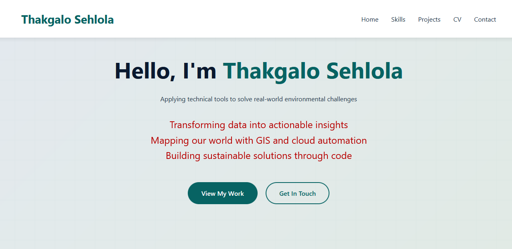
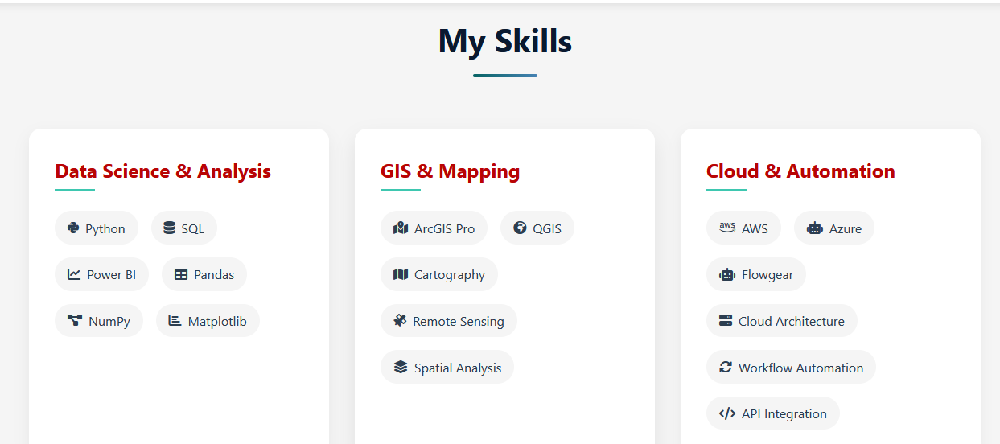
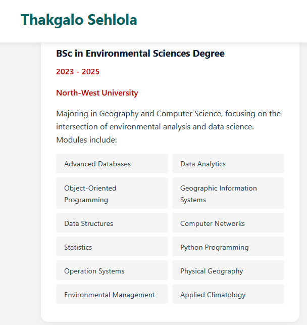

# Thakgalo Sehlola Portfolio Website

A modern, responsive portfolio website showcasing my work as a Data Analyst and Environmental Scientist.

## 🌟 Live Demo
Visit the live website: [thakgalo-sehlola.netlify.app](https://thakgalo-sehlola.netlify.app)

## 📸 Screenshots

### Home Page

*A clean, modern landing page with animated taglines*

### Skills Section

*Showcase of technical and domain expertise*

### Timeline

*Professional journey and education timeline*

## 🚀 Features
- Responsive design for all devices
- Interactive project cards
- Smooth scroll animations
- Dynamic timeline
- Contact form integration
- Downloadable CV
- Google Analytics integration
- Accessibility optimized

## 🛠️ Technologies Used
- HTML5
- CSS3
- JavaScript
- FontAwesome Icons
- Google Analytics
- Netlify Forms

## 🏗️ Project Structure
```
portfolio/
├── index.html
├── style.css
├── script.js
├── assets/
│   └── screenshots/
└── README.md
```

## 📱 Mobile Responsive
The website is fully responsive and optimized for:
- Desktop (1200px+)
- Tablet (768px - 1199px)
- Mobile (320px - 767px)

## 📝 Development
1. Clone the repository
2. Open index.html in your browser
3. Make changes to HTML, CSS, or JavaScript files
4. Deploy to Netlify